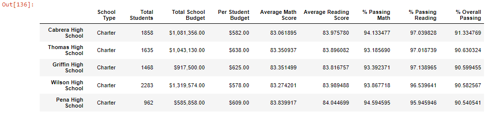
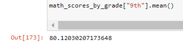
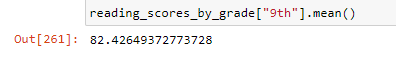
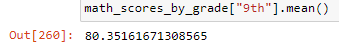

# School_District_Analysis

## Overview of the school district analysis
There is a suspicion that math and reading scores at Thomas High School are unreliable. Therefore, it has been required to change the notes with NaNs while leaving the rest of the data intact. The aim of the analysis is to verify how these changes affected the overall analysis.
## Results
The first district summary dataframe reflects the data of all students of the district without taking off the "ninth grade level" of  Thomas High School. It shows the same result as it has been gotten from the module.
In the case of school summary dataframe, it considers all the data from the module and the results that has been gotten are the same after looking the data without roundling.

After replacing with no scores the ninth graders math and reading scores, Thomas High School is located in the second place of top five schools in terms of overall passing percentage. This result is different from no replacing the ninth grade ,because in that case the overall passing percentage had a lower value.

   

Doing a comparison between math and reading scores by grade, the "nan" has replaced the value of ninth grade for math and reading score. The mean value math score of ninth grade has decreased from 80.35167 to 80.12030 after taking off the scores of math for the ninth grade of Thomas High school. While, the reading score has decreased from 82.5133 to 82.42649.
About scores by school spending, in the case of math scores, there is an increase after replacing the values of ninth grade of Thomas High School, specially when spending per student is higher. On the other hand, in the case of reading scores, there is an increase as well after replacing the values and increasing of spending per student is greater.
After replacing the value of ninth grade of Thomas High school, it has been found that there is a bit of decreasing of overall passing percentage in Medium School Size which went from 90.62 to 90.56.
Regarding the type of school, the overall passing rate of charter school has decreased slightly from 90.43 to 90.39 after replacing the values of ninth grade of Thomas High School.
## Summary
In conclusion, After reading and math scores for the ninth grade have been replaced with NaNs, Thomas High school became in the second place of top five schools
Secondly, It seenms the spending per student became more efficient after the replacement of values. Also, there was an slightly decreasing of overall passing percentage for medium school size. Finally, the scores for the ninth grade in math and reading scores have slightly decreased.
